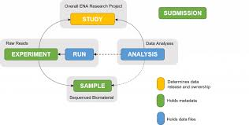

# 📤 ENA Raw Read Submission Pipeline

This pipeline walks you through submitting raw sequencing reads to the **European Nucleotide Archive (ENA)**.

Read file formats supported are: CRAM, BAM, Single-end FASTQ, Paired-end FASTQ, HDF5 and FAST5

Read submission can be completed in 3 steps:
1. Sample metadata upload via web interface
2. Read upload via command line interface
3. Read metadata upload via web interface

[`-> Go to metadata collection`](./ena-metadata-collection.md)

ALWAYS complete a [`test version`](https://wwwdev.ebi.ac.uk/ena/submit/webin/login) first and then repeat the steps for the [`production version`](https://www.ebi.ac.uk/ena/submit/webin/login)

## 📋 Uploading data to ENA Webin Submissions Portal

1. Register user on [`Webin Submissions Portal`](https://www.ebi.ac.uk/ena/submit/webin/accountInfo). Center name is sequencing facility name. For example, MDC/BIH Genomics Facility
2. Register study on the test service. Release date can be pushed back or forward based on need
3. After this, Study Acession will become available in Studies Report. It starts with "PRJEB". Save it for later use
   (3 lines on top left part of the screen opens the dashboard for navigation)
4. Register samples -> Download spreadsheet. For human or mouse RNA-seq data, choose "Other checklists". Next, for human/mouse data, choose default checklist. Fill up ([`see here for help`](./ena-metadata-collection.md)), go back to "Register samples" on dashboard and select Upload. Get assigned sample accession IDs from "Samples Report". We need these to finish the read files checklist.
For environmental and organismal (host-associated) samples, check resource 2.
5. We can now follow Step 4 in resource 2.
   a. We need the md5sum check to verify read file integrity after upload. In the folder with the read files, run in terminal:

      for f in *.gz; do md5 $f | awk '{ gsub(/\(|\)/,""); print $1"\t" $2 }'; done > md5sums.tsv

      This creates a tab-separated file with the md5sums and the file names. Make sure the correct information is in the file. It should look like this (or in the reverse order of the columns):

                                                                                     
      3b078583e52381db7d88abf7912b76c1	i712_0001_CGGGAACCCGCA_i512A_0001_GTCTTTGGCCCT_R1.fastq.gz
      de91c8fc0d76dbfe05a45e7431109c97	i712_0002_AAACGTTCATCC_i512A_0002_TTAGTAACTGGG_R1.fastq.gz

      If the correct info is not on the tsv file, print out the output of 
      
      md5sum i712_0031_AAAATCCCAGTT_i512A_0031_AACGTTTAGGGG_R1.fastq.gz | awk '{ gsub(/\(|\)/,""); print $1"\t" $2 }'
      
      but insert your own read file name. Check by changing 1 and 2 to 3 and 4 in the command what gives out one such row as an output. 
      
      This works for Mac and Linux. For Windows, check online for an easy method (for example, [`see this`](https://stackoverflow.com/questions/41838664/md5-hash-of-files-in-a-windows-folder))
      
   b. With the md5sums in place, it is time to upload the read files to the ftp server of ENA. This will be a long process based on total upload data. Can choose to remotely upload or do it the following day on the production service.
      
      # Connect to FTP server [replace X:s, and provide password when prompted]
      lftp webin2.ebi.ac.uk -u Webin-XXXXX
      # Expected response: lftp Webin-XXXXX@webin2.ebi.ac.uk:~>
      
      # Transfer your read files
      mput ~/your-read-file-dir/*.fastq.gz
      # Expected response: ... Total x files transferred
      
      # Disconnect from server
      bye
      
      This works for Mac and Linux. [`Example on Windows.`](https://unihost.com/blog/how-to-connect-to-ftp-server/)

8. After uploading read files, it is time to upload the read files checklist along with the md5sum for each file. Go back to Dashboard -> Submit Reads -> Select download option based on file format -> fill up ([`see here for help`](./ena-metadata-collection.md)) -> upload.

Here, it is critical that the md5sums should match with the files on the FTP server. Once they do, "Run Files Report" on dashboard will indicate this with "File archived" or similar. If there are errors, you will see it immediately.

Troubleshoot - check md5sums of data in original source if possible. Redo md5sum step. Write to ENA help if it doesn't resolve, via "Support" in Webin user area. In case of "internal errors", they usually resolve without intervention.

That's it!! All done.

Now log in to production service https://www.ebi.ac.uk/ena/submit/webin/login. Caution: Study and sample accessions will be different to test service. Get the current info from corresponding reports on the dashboard.

For other errors like "internal checking error", etc, give it a couple of days to resolve on the production service. Contact support if errors persist.

Resource 1: https://ena-docs.readthedocs.io/en/latest/submit/general-guide/interactive.html

Resource 2: https://biodiversitydata-se.github.io/mol-data/ena-metabar.html

## 🖼️ Workflow Diagram

## 🧾 Scripts

- [`submission_template.xml`](https://github.com/your-username/scripts/blob/main/submission_template.xml)
- Metadata file example included in the repository

---
